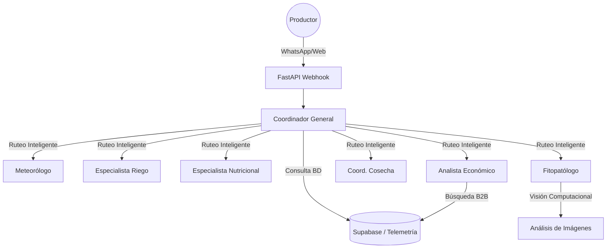

# Arquitectura Agentes IA (LangGraph) - AgroConecta

El núcleo de inteligencia de AgroConecta se basa en un ecosistema de agentes implementados en **Python (FastAPI + LangGraph + LangChain)**. Este orquestador atiende tanto las peticiones del portal web como los webhooks de WhatsApp (n8n).

## Ecosistema Multi-Agente

## Especificaciones de los Agentes
1. **Supervisor:** Ruteador semántico principal. Extrae intención y datos, consulta las herramientas (`get_parcel_info`, `get_latest_copernicus_telemetry`) y deriva la conversación al nodo adecuado.
2. **Fitopatólogo (`pest_specialist`):** Capaz de procesar imágenes enviadas por el usuario para detectar enfermedades aplicando visión computacional (Gemini Flash). Proporciona consejos de Manejo Integrado de Plagas (MIP).
3. **Especialista en Riego (`irrigation_specialist`):** Analiza el NDMI satelital. Si cae debajo de 0.4, alerta sobre déficit hídrico.
4. **Analista Económico (`economic_analyst`):** Tiene acceso a la herramienta `get_b2b_providers` para buscar proveedores cercanos de insumos o maquinaria cuando el productor requiere intervención inmediata.

## Manejo de Estado (Memoria)
La memoria de la conversación se almacena en Supabase en la tabla `agent_memory_state` usando el número de teléfono del usuario como `thread_id`, lo que permite una conversación fluida y con contexto en sesiones prolongadas.
