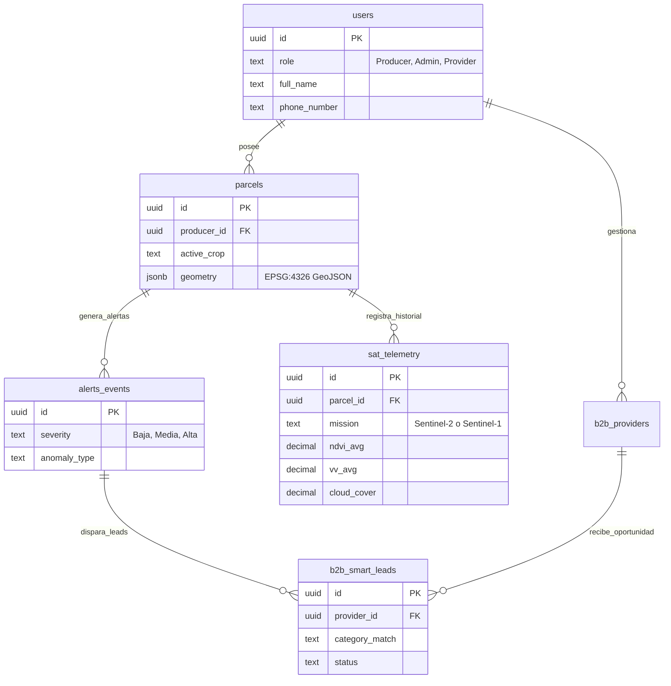

# Arquitectura Backend y Datos - AgroConecta

El sistema se fundamenta en **Supabase (PostgreSQL)** como motor de base de datos y autenticación, apoyado por Row Level Security (RLS) para aislamiento de tenants (Productores y Proveedores).

## Modelo de Datos Principal

## Reglas de Negocio (RLS)
- **Productores:** Solo pueden ver y editar la telemetría, alertas y geometría de sus propias parcelas.
- **Proveedores:** Pueden ver la información pública de otros proveedores y gestionar su propio perfil. Reciben leads B2B cuando la IA hace "match".
- **Sistema (Service Role):** El backend Python y los agentes cron operan ignorando el RLS (`service_role_key`) para actualizar masivamente los datos de todas las parcelas.
